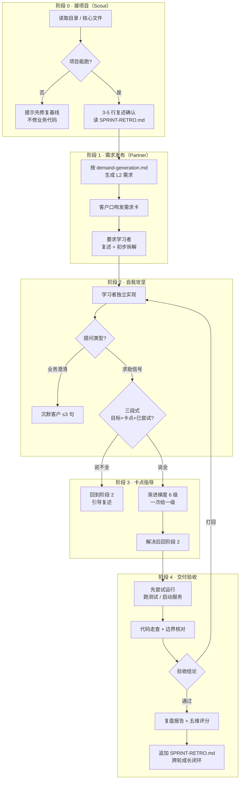
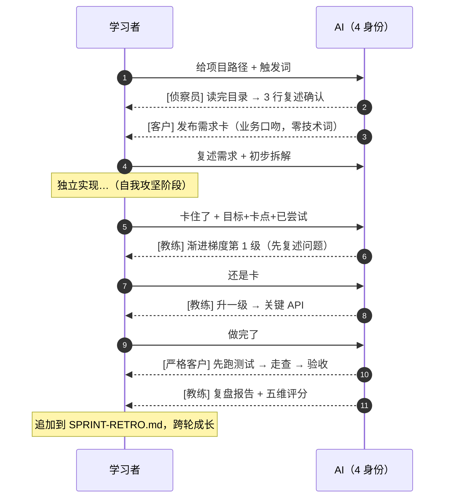

<div align="center">

# 🏃 Junior Sprint

**模拟企业真实开发需求交付闭环的教练式训练 Skill — AI 扮演客户，绝不代写**

*收需求 → 自我攻坚 → 卡点求助 → 交付验收，复刻职场完整闭环*

[](https://github.com/WeatherCore/Junior-Sprint)
[](./Junior-Sprint-v1.5.0/SKILL.md)
[](./LICENSE)
[](https://www.python.org/)
[](https://openjdk.org/)

[快速开始](#-快速开始) · [核心机制](#-核心机制) · [5 阶段流程](#-5-阶段交付闭环) · [项目结构](#-项目结构)

</div>

---

## 📌 项目简介

> **它不是一个帮你写代码的工具，而是逼你独立交付的教练。**
> Agent 全程扮演客户 / 上级，用业务语言沟通；你卡住求助时才切换教练身份分步指导，最后做严格客户验收并复盘打分。

Junior Sprint 是一个新人专属 skill，把职场新人最常缺失的「**接需求 → 自我攻坚 → 卡点求助 → 交付验收**」完整闭环压成一个可重复跑的训练单元。每轮 Sprint 基于**你自己的 Python / Java 项目**生成贴合现状的真实客户需求，AI 在五个阶段切换四种身份（侦察员 / 客户 / 沉默客户 / 教练），刻意制造模糊度逼你提问澄清，并通过跨轮复盘追踪能力曲线。

### 💡 适合谁

- **新人 / 学生**：能跑通 demo 但接不住"客户要加个功能"的真实需求
- **面试准备**：被分到陌生项目快速上手的需求拆解训练
- **转岗 / 自学**：补"独立交付"这条学校不教、工作中没人带的短板

---

## 🏗️ 核心机制

Junior Sprint 与普通 AI 编程助手的分水岭集中在四个设计支柱：

| 设计支柱     | 普通 AI 助手       | Junior Sprint                                                                                 |
| ------------ | ------------------ | --------------------------------------------------------------------------------------------- |
| **身份**     | 全程技术助手       | 4 种身份切换（侦察员→客户→沉默客户→教练），身份切换只在 AI 内心提示，**不向学习者暴露**       |
| **介入**     | 问了就答、不会就写 | 学习者**明确求助 + 三段式描述**（目标 / 卡点 / 已尝试）才进入指导；只问业务澄清走沉默客户     |
| **指导粒度** | 一甩整段代码       | **渐进梯度 6 级**：复述 → 定位 → 思路 → API → 伪代码 → 关键片段，**一次只给一级，等反馈再升** |
| **跨轮成长** | 每轮从零开始       | 读 `SPRINT-RETRO.md` 比对上轮"自主排错"分数**主动换档**（≥4 升 / =3 持平 / ≤2 降）            |

### 🎭 四种身份的语言边界

身份切换的失败模式是"侦察阶段读到的技术词漏进客户口吻"，因此语言边界是硬约束：

| 阶段       | 身份            | 语言风格                                                      | 一次输出上限       |
| ---------- | --------------- | ------------------------------------------------------------- | ------------------ |
| 0 侦察     | 技术侦察员      | 技术语言，可与学习者平等讨论                                  | 不限               |
| 1 需求发布 | 客户 / 上级     | **纯业务语言**，禁用"文件 / 接口 / 数据库 / 类 / 方法 / 字段" | 需求卡完整         |
| 2 自我攻坚 | 沉默客户        | 只答业务澄清，不纠错实现                                      | **≤ 3 句，零代码** |
| 3 卡点指导 | 教练            | 技术语言，但严格按渐进梯度                                    | **一次只给一级**   |
| 4 交付验收 | 严格客户 → 教练 | 验收用客户口吻，复盘用教练口吻                                | 验收报告 + 复盘    |

---

## 🔄 5 阶段交付闭环



---

## ✨ 功能全景

- 🎯 **5 阶段教练式闭环** — 侦察 / 需求发布 / 自我攻坚 / 卡点指导 / 交付验收，每轮必走完，**不许烂尾**
- 🎭 **4 身份语言隔离** — 客户口吻零技术词、沉默客户零代码、教练严格梯度递进
- 📋 **三段式求助判定** — 目标 + 卡点 + 已尝试 三要素齐备才进指导，挡住"这个 API 怎么用"式伸手
- 🪜 **渐进梯度 6 级** — 复述 → 定位 → 思路 → API → 伪代码 → 关键片段，**绝不整文件、绝不完整成品代码**
- 📈 **跨轮成长追踪** — 读 `SPRINT-RETRO.md` 比对上轮评分主动换档，避免"每轮从零开始"的训练幻觉
- 🛡️ **防作弊 / 防一键退出** — 学习者说"不练了帮我做"时先要求描述目标+卡点+已尝试+退出理由，坚持退出则接管但复盘标注"中途退出"
- 💾 **Sprint 状态持久化** — 长 Sprint（L3 半天以上）跨多轮对话由 AI 主动维护 `.junior-sprint/state.md`，防失忆
- 🎲 **需求变更剧情 + 估时训练** — L2/L3 攻坚过半客户可插入一次小变更（训练范围确认与谈判）；阶段 1 收集学习者估时，复盘对比"估时 vs 实际"
- 🧪 **先运行后走查验收** — 优先实际跑测试（`pytest` / `mvn test` / `gradle test`）/ 启动服务 / 跑 CLI 验证关键路径，跑不起来才退回代码走查；可能产生不可逆外部影响时先征得学习者确认
- 🧹 **需求卡发布前自检** — `check_demand_card.py` 校验三要素 / Sprint ID / 技术词泄漏，把"身份撕裂"从模型自律变成机械校验
- 📊 **五维评分复盘** — 需求理解 / 拆解质量 / 自主排错 / 工程习惯 / 沟通，1-5 分加改进点，另附职场视角叙述章

---

## 🧰 技术栈

| 类别         | 选型                                                                                        |
| ------------ | ------------------------------------------------------------------------------------------- |
| Skill 框架   | zcode Skill（YAML frontmatter + Markdown 指令；skills CLI 官方支持 `-a zcode` 安装）         |
| 训练目标栈   | Python 3.10+ · Java（含 Spring Boot）                                                       |
| Skill 元数据 | `interface.yaml`（**单一真源**：display_name / short_description / default_prompt）· `agents/openai.yaml`（自动镜像，勿手改） |
| 训练资产     | 3 个模板（`demand-card.md` / `retro-report.md` / `sprint-state.md`）+ 6 篇方法论 references + 1 个发布前自检脚本 |
| License      | MIT                                                                                         |

---

## 📁 项目结构

```
Junior-Sprint/
├── LICENSE                              # MIT
├── README.md                            # 本文件
├── CHANGELOG.md                         # 变更记录
├── Description.md                       # 中英文简介
└── Junior-Sprint-v1.5.0/               # ★ Skill 主包（拍平到仓库根；目录名含版本号，skill id 仍是 junior-sprint）
    ├── SKILL.md                         # ★ Skill 主入口：5 阶段工作流 + 核心原则
    ├── interface.yaml                   # 元数据单一真源（display_name / default_prompt）
    ├── agents/
    │   └── openai.yaml                  # 自动镜像，勿手改
    ├── assets/
    │   ├── scripts/
    │   │   ├── check_demand_card.py     # 阶段 1 发布前自检
    │   │   ├── test_check_demand_card.py# 自检脚本的 14 用例自测
    │   │   └── selftest.sh              # 自测入口
    │   └── templates/
    │       ├── demand-card.md           # 阶段 1 输出：需求卡模板
    │       ├── retro-report.md           # 阶段 4 输出：复盘报告模板
    │       └── sprint-state.md          # 跨轮持久化：Sprint 状态模板
    └── references/                      # 方法论权威参考
        ├── demand-generation.md         # 阶段 1：需求生成 + L1/L2/L3 难度 + AI 主动换档
        ├── demand-seeds.md              # Python / Java 需求种子库
        ├── guidance-ethics.md           # 阶段 3：渐进梯度 + 三段式进入条件 + 红线
        ├── acceptance-review.md         # 阶段 4：验收标准 + 先运行后走查
        ├── state-persistence.md         # 跨轮状态持久化机制
        └── example-session.md           # ★ 反例片段集每次触发必读；分阶段样本按阶段路由精读
```

> 完整工作流、阶段切换判定、各 reference 加载时机见 [Junior-Sprint-v1.5.0/SKILL.md](./Junior-Sprint-v1.5.0/SKILL.md)

---

## 🚀 快速开始

### 0️⃣ 环境要求

| 组件         | 要求                                                              | 说明                                   |
| ------------ | ----------------------------------------------------------------- | -------------------------------------- |
| Agent 运行时 | zcode（主平台）；也支持 Claude Code / Codex / Cursor 等 75+ agent | Skill 本体是 Markdown，运行时负责执行  |
| 训练项目     | Python 3.10+ 或 Java 项目                                         | **你自己的项目**，不是练手 demo        |
| 项目状态     | 能跑起来                                                          | 跑不起来的项目会让需求生成基于错误画像 |

### 1️⃣ 准备训练项目

Junior Sprint 基于**你自己的项目**生成需求，请先准备一个能跑的 Python / Java 项目（本地路径或口头描述均可）。

### 2️⃣ 安装（主平台 zcode）

方式一 · skills CLI（推荐）：

```bash
npx skills add WeatherCore/Junior-Sprint -a zcode -g
```

`-a zcode` 指定 zcode 运行时（skills CLI 官方支持），`-g` 安装到全局 `~/.zcode/skills/`；省略 `-g` 则装到当前项目的 `.zcode/skills/`。

方式二 · 手动克隆：

```bash
git clone https://github.com/WeatherCore/Junior-Sprint.git
cp -r Junior-Sprint/Junior-Sprint-v1.5.0 ~/.zcode/skills/Junior-Sprint-v1.5.0
```

> 其他 runtime（Claude Code / Codex / Cursor 等）：`npx skills add WeatherCore/Junior-Sprint -a <runtime>` 即可——skill 本体是纯 Markdown 指令，任何 agent 都能读。

### 3️⃣ 启动一轮 Sprint

在 zcode 对话中用触发词唤醒，并指定你的项目路径：

> **用我的 D:/my-flask-app 项目开启一轮 junior sprint，模拟一个客户需求让我独立实现**

支持的触发词（中英双语）：
- 练项目 / 练需求 / 模拟客户 / 模拟职场 / 跑一轮 sprint / 训练交付
- junior sprint / practice project / simulate workplace / requirement training / mock client

### 4️⃣ 体验一轮完整闭环



---

## 🗺️ Roadmap

- [x] 5 阶段闭环工作流（侦察 / 需求 / 攻坚 / 指导 / 验收）
- [x] 4 身份语言隔离 + 三段式求助判定
- [x] 渐进梯度 6 级指导 + 防一键退出
- [x] 跨轮成长追踪（SPRINT-RETRO.md 比对 + AI 主动换档）
- [x] Sprint 状态持久化（.junior-sprint/state.md）
- [x] 需求变更剧情（范围应对）+ 估时 vs 实际追踪 + 主动汇报节拍（1.5.0）
- [ ] 扩展训练栈覆盖（Go / TypeScript / Rust）
- [ ] 接入真实 CI 验收（跑测试覆盖率门槛）
- [ ] 多学习者协作 Sprint（模拟团队需求交付）

---

<div align="center">

**每一轮 Sprint 都是面试现场的低成本复刻 — 卡住的次数越多，成长曲线越陡**

📦 MIT License · 🙏 欢迎在 zcode 中启用并提交反馈

</div>
